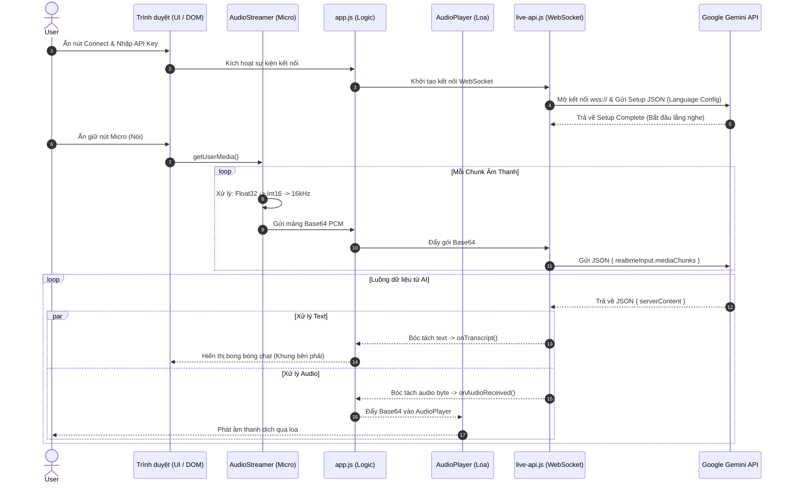

# Hệ thống Dịch thuật Trực tiếp (Live Translation System) - Tài liệu Kỹ thuật

Tài liệu này mô tả chi tiết kiến trúc, các thành phần công nghệ, hàm chức năng và luồng dữ liệu (Data Flow) của ứng dụng web Live Translation sử dụng mô hình Gemini API.

## 1. Tổng quan Công nghệ (Tech Stack)

Ứng dụng là một web app Client-side thuần túy (Vanilla Web App) không cần đến backend xử lý logic phức tạp.
* **Ngôn ngữ:** HTML5, CSS3, JavaScript (ES6+).
* **Giao tiếp mạng:** WebSocket (`wss://`) để kết nối song phương thời gian thực với Google Gemini Live API.
* **Xử lý Âm thanh (Audio Processing):** Web Audio API (`AudioContext`, `AudioWorklet`, `MediaDevices.getUserMedia`).
* **Lưu trữ dữ liệu:** Trình duyệt `localStorage` để lưu trữ API Key và Lịch sử trò chuyện.
* **Mô hình AI:** `gemini-3.5-live-translate-preview` (thông qua điểm cuối API `v1alpha`).

---

## 2. Kiến trúc & Các thành phần (Architecture & Components)

Hệ thống được chia thành 3 lớp file chính đảm nhận các trách nhiệm riêng biệt:

### 2.1. Lớp Giao diện & Cấu trúc (`index.html` & `style.css`)
Định nghĩa giao diện hiển thị cho người dùng, bao gồm:
* **Translation Controls:** Dropdown chọn Ngôn ngữ nguồn (Source Language) và Ngôn ngữ đích (Target Language).
* **Split View Container:** Chia màn hình thành hai nửa song song (Trái: Text nguồn, Phải: Text đích).
* **Action Bar:** Các nút bấm chính (Bật/tắt Micro, Lưu Lịch sử).
* **History Sidebar:** Thanh trượt ẩn bên trái hiển thị danh sách các đoạn hội thoại đã lưu.

### 2.2. Lớp Xử lý Âm thanh (`audio-handler.js`)
Lớp này bao gồm 2 Class chính phục vụ việc thu và phát âm thanh thời gian thực:

1. **`AudioStreamer` (Thu âm & Xử lý micro):**
   - **`start()`**: Xin quyền sử dụng Micro thông qua `navigator.mediaDevices.getUserMedia({ audio: true })`.
   - Sử dụng `AudioContext` để lấy luồng âm thanh đầu vào.
   - **`AudioWorkletProcessor`**: Một đoạn script chạy đa luồng ở background. Biến đổi dữ liệu mảng Float32 (mặc định của Web Audio) thành mảng số nguyên Int16 (mặc định yêu cầu của Gemini API) và lấy mẫu ở tần số 16kHz (`sampleRate: 16000`).
   - Sau khi xử lý buffer, mã hóa chuỗi byte sang chuẩn Base64.
   - **Callback `onAudioData(base64PCM)`**: Đẩy gói dữ liệu âm thanh đã mã hóa lên lớp Logic (`app.js`).
   - **`stop()`**: Hủy bỏ luồng thu âm và giải phóng bộ nhớ.

2. **`AudioPlayer` (Phát âm thanh từ AI):**
   - **`playAudio(base64PCM)`**: Nhận chuỗi Base64 từ Gemini trả về, giải mã (decode) ngược lại thành mảng Int16, chuyển đổi sang Float32 để nạp vào `AudioBuffer`.
   - **Scheduling**: Tính toán độ trễ (delay) một cách mượt mà và xếp hàng (queue) các frame âm thanh vào `AudioBufferSourceNode` để phát qua loa ngoài mà không bị giật lag.

### 2.3. Lớp Giao tiếp API (`live-api.js`)
Lớp **`LiveAPI`** đóng vai trò cầu nối WebSocket giữa trình duyệt và Google Servers.

* **`connect()`**: Khởi tạo kết nối đến `wss://generativelanguage.googleapis.com/ws/google.ai.generativelanguage.v1alpha.GenerativeService.BidiGenerateContent?key=...`
* **`Setup Message`**: Ngay sau khi WebSocket `onopen`, gửi một cục payload JSON để cấu hình AI:
  ```json
  {
    "setup": {
      "model": "models/gemini-3.5-live-translate-preview",
      "generationConfig": {
        "responseModalities": ["AUDIO"],
        "translationConfig": {
          "targetLanguageCode": "...",
          "echoTargetLanguage": true
        }
      }
    }
  }
  ```
  *(Lưu ý: Ngôn ngữ nguồn luôn được mô hình tự động nhận diện thông qua giọng nói).*
* **`sendAudio(base64PCM)`**: Bao gói chuỗi Base64 thành payload `realtimeInput.mediaChunks` và gửi đi liên tục.
* **`handleResponse(serverContent)`**: Parsing (phân tích) cục JSON do Google trả về, trong đó:
  - Bóc tách `serverContent.modelTurn.parts[0].inlineData.data` -> Đẩy vào callback `onAudioReceived` để loa phát ra.
  - Bóc tách `serverContent.interrupted` -> Xóa hàng chờ âm thanh nếu AI bị ngắt lời.
  - Bóc tách `serverContent.modelTurn.parts` -> Lấy ra văn bản dịch (Target Transcript) đẩy vào `onTranscript(text, 'target')`.
  - Bóc tách `serverContent.turnComplete` -> Xác nhận kết thúc một lượt thoại.

### 2.4. Lớp Logic Ứng dụng (`app.js`)
Lớp Controller điều phối toàn bộ các thành phần trên và tương tác trực tiếp với DOM:

* **Quản lý Vòng đời:** Khởi tạo `AudioPlayer`, `LiveAPI` khi ấn *Connect*.
* **Routing Văn bản:**
  - `addTranscript(text, role)`: Tạo các bong bóng chat (`<div class="chat-bubble">`) mới. Hàm có logic ghép các phần text đang được stream dở dang (timeout 2s) vào cùng một bóng thoại.
  - Tự động cuộn xuống cuối khung chat (`scrollToBottom`).
* **Lịch sử Trò chuyện (History):**
  - Đọc / Ghi vào `localStorage` với key `gemini_chat_history`.
  - Format đối tượng: `{ timestamp, sourceLang, targetLang, sourceHtml, targetHtml }`.
  - Khôi phục giao diện (DOM Replacement) khi người dùng nhấp vào một dòng lịch sử cũ (`historyList.addEventListener`).

---

## 3. Luồng dữ liệu thời gian thực (Real-time Data Flow)

Hệ thống hoạt động theo kiến trúc luồng dữ liệu song song (Bidi-Streaming), vừa đẩy dữ liệu lên và vừa nhận dữ liệu xuống cùng một lúc. Dưới đây là sơ đồ luồng dữ liệu chi tiết:



**[Luồng 1]: Từ Người dùng -> Gemini API (Upstream)**
1. **User** ấn giữ biểu tượng Micro.
2. `AudioStreamer` đọc âm thanh từ phần cứng, cắt nhỏ thành các khối (chunks) liên tục.
3. Chunks được chuyển thành 16kHz Int16 -> Base64.
4. `app.js` nhận Base64 và gọi `liveApi.sendAudio(base64PCM)`.
5. `LiveAPI` đẩy gói JSON qua **WebSocket** lên máy chủ Google.

**[Luồng 2]: Từ Gemini API -> Giao diện Người dùng (Downstream)**
1. **Google Gemini** phân tích âm thanh gửi lên, tự động nhận diện ngôn ngữ nguồn.
2. Mô hình stream (trả về từng mảnh nhỏ) dữ liệu JSON về trình duyệt qua **WebSocket**.
3. `LiveAPI.ws.onmessage` kích hoạt:
   - Nếu có đoạn text được dịch -> Gọi `app.js` (`onTranscript`) -> Render chữ ra màn hình (Ô bên phải).
   - Nếu có byte âm thanh giọng nói trả lời -> Gọi `app.js` (`onAudioReceived`) -> Chuyển cho `AudioPlayer`.
4. `AudioPlayer` decode thành Float32 và phát ra loa song song với lúc text đang hiển thị.

## 4. Bảo mật và Cân nhắc (Security & Considerations)
- **API Key:** Ứng dụng sử dụng API Key do người dùng nhập trực tiếp từ Client-side. Key chỉ lưu vào bộ nhớ trình duyệt `localStorage` của máy cá nhân, đảm bảo không bị rò rỉ ra các máy chủ bên thứ 3.
- **Microphone Permissions:** Trình duyệt sẽ luôn yêu cầu quyền truy cập micro (`getUserMedia`). Hệ thống chỉ thu âm khi thiết lập trạng thái kết nối `isConnected`.
